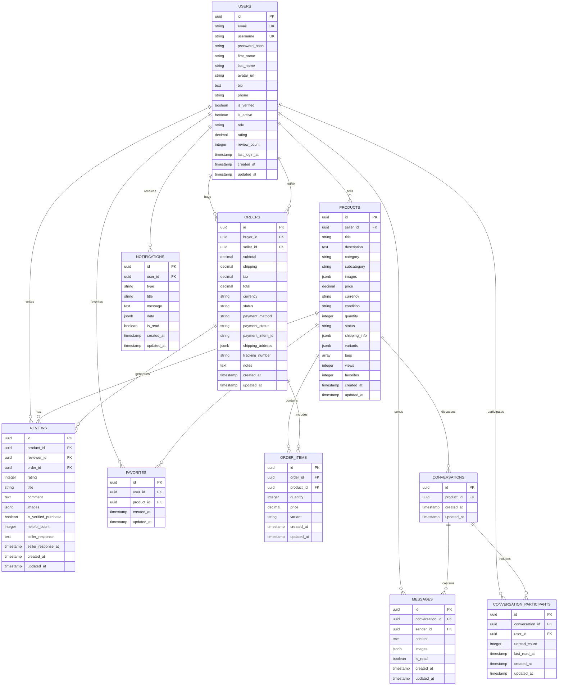

# Database Entity Relationship Diagram (ERD)

## Overview
This document describes the database schema and relationships for the Quantum Marketplace Exchange platform.

## Tables and Relationships

### Users
- **Primary Key**: id (UUID)
- **Relationships**:
  - One-to-Many with Products (as seller)
  - One-to-Many with Orders (as buyer)
  - One-to-Many with Orders (as seller)
  - One-to-Many with Reviews (as reviewer)
  - One-to-Many with Messages (as sender)
  - Many-to-Many with Conversations (through conversation_participants)
  - One-to-Many with Favorites
  - One-to-Many with Notifications

### Products
- **Primary Key**: id (UUID)
- **Foreign Keys**:
  - seller_id → users.id
- **Relationships**:
  - Many-to-One with Users (seller)
  - One-to-Many with OrderItems
  - One-to-Many with Reviews
  - One-to-Many with Favorites
  - One-to-Many with Conversations

### Orders
- **Primary Key**: id (UUID)
- **Foreign Keys**:
  - buyer_id → users.id
  - seller_id → users.id
- **Relationships**:
  - Many-to-One with Users (buyer)
  - Many-to-One with Users (seller)
  - One-to-Many with OrderItems
  - One-to-Many with Reviews

### OrderItems
- **Primary Key**: id (UUID)
- **Foreign Keys**:
  - order_id → orders.id
  - product_id → products.id
- **Relationships**:
  - Many-to-One with Orders
  - Many-to-One with Products

### Reviews
- **Primary Key**: id (UUID)
- **Foreign Keys**:
  - product_id → products.id
  - reviewer_id → users.id
  - order_id → orders.id (nullable)
- **Relationships**:
  - Many-to-One with Products
  - Many-to-One with Users (reviewer)
  - Many-to-One with Orders

### Conversations
- **Primary Key**: id (UUID)
- **Foreign Keys**:
  - product_id → products.id (nullable)
- **Relationships**:
  - Many-to-One with Products (optional)
  - One-to-Many with Messages
  - Many-to-Many with Users (through conversation_participants)

### ConversationParticipants
- **Primary Key**: id (UUID)
- **Foreign Keys**:
  - conversation_id → conversations.id
  - user_id → users.id
- **Relationships**:
  - Many-to-One with Conversations
  - Many-to-One with Users

### Messages
- **Primary Key**: id (UUID)
- **Foreign Keys**:
  - conversation_id → conversations.id
  - sender_id → users.id
- **Relationships**:
  - Many-to-One with Conversations
  - Many-to-One with Users (sender)

### Favorites
- **Primary Key**: id (UUID)
- **Foreign Keys**:
  - user_id → users.id
  - product_id → products.id
- **Relationships**:
  - Many-to-One with Users
  - Many-to-One with Products

### Notifications
- **Primary Key**: id (UUID)
- **Foreign Keys**:
  - user_id → users.id
- **Relationships**:
  - Many-to-One with Users

## Diagram (Mermaid)

## Key Design Decisions

1. **UUID Primary Keys**: Using UUIDs instead of auto-incrementing integers for better distributed system support and security.

2. **Soft Deletes**: All major tables include a `deleted_at` timestamp for soft deletion capability.

3. **JSONB Fields**: Using JSONB for flexible data storage (images, shipping info, variants) with indexing capabilities.

4. **Timestamps**: All tables have `created_at` and `updated_at` timestamps with automatic update triggers.

5. **Cascading Deletes**: Proper foreign key constraints with appropriate cascading behavior.

6. **Indexes**: Strategic indexes on frequently queried columns for performance optimization.

7. **Check Constraints**: Enum-like constraints on status fields for data integrity.

8. **Normalized Design**: Proper normalization with separate tables for order items, conversation participants, etc.
