# User Flow Diagrams
# Quantum Marketplace Exchange

This document contains Mermaid diagrams for all major user flows in the Quantum Marketplace Exchange platform.

---

## Table of Contents

1. [User Registration & Onboarding](#1-user-registration--onboarding)
2. [Product Search & Discovery](#2-product-search--discovery)
3. [Product Purchase Flow](#3-product-purchase-flow)
4. [Selling a Product](#4-selling-a-product)
5. [Messaging Flow](#5-messaging-flow)
6. [Review & Rating Flow](#6-review--rating-flow)
7. [Order Management](#7-order-management)
8. [Dispute Resolution](#8-dispute-resolution)

---

## 1. User Registration & Onboarding

### New User Registration

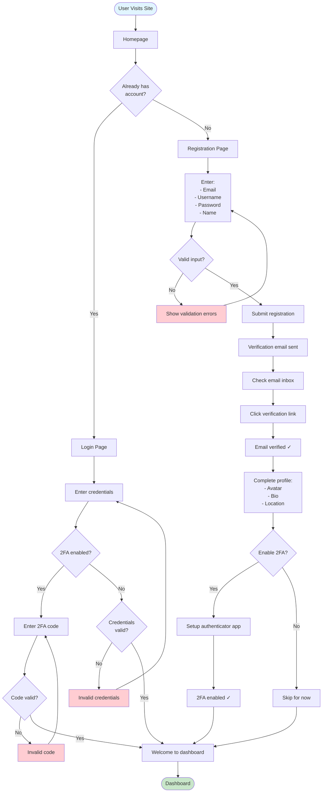

### Social Login Flow

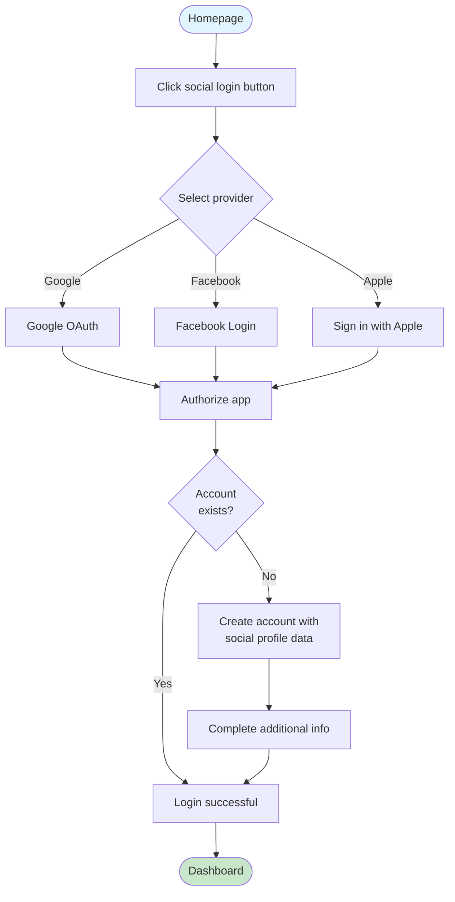

---

## 2. Product Search & Discovery

### Search Flow

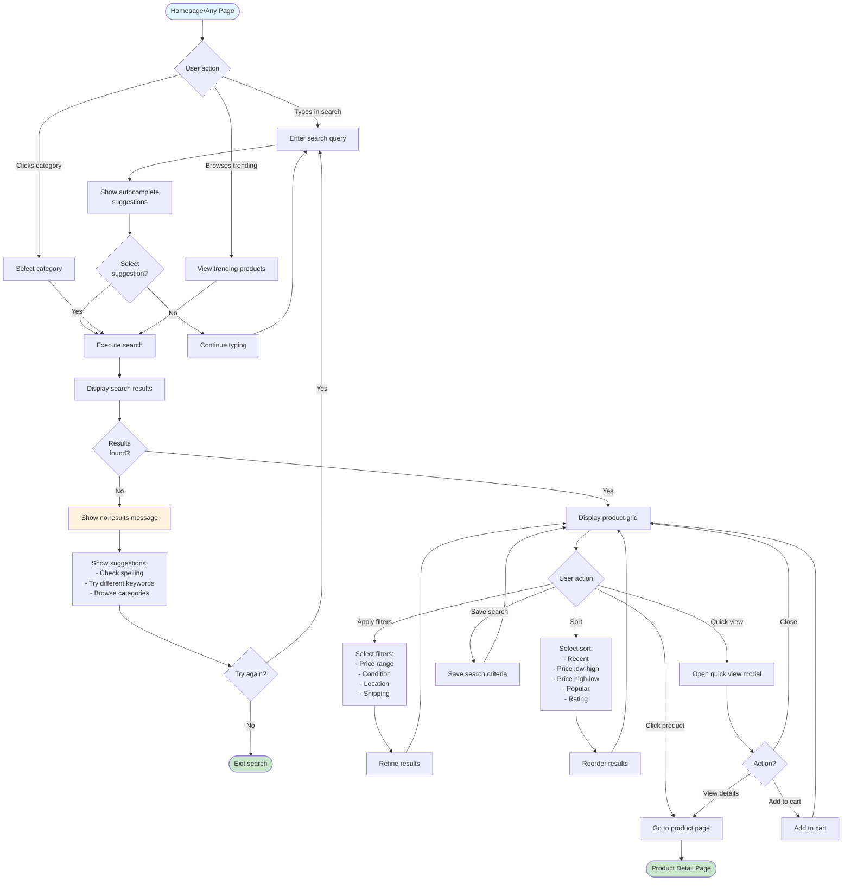

### Product Discovery

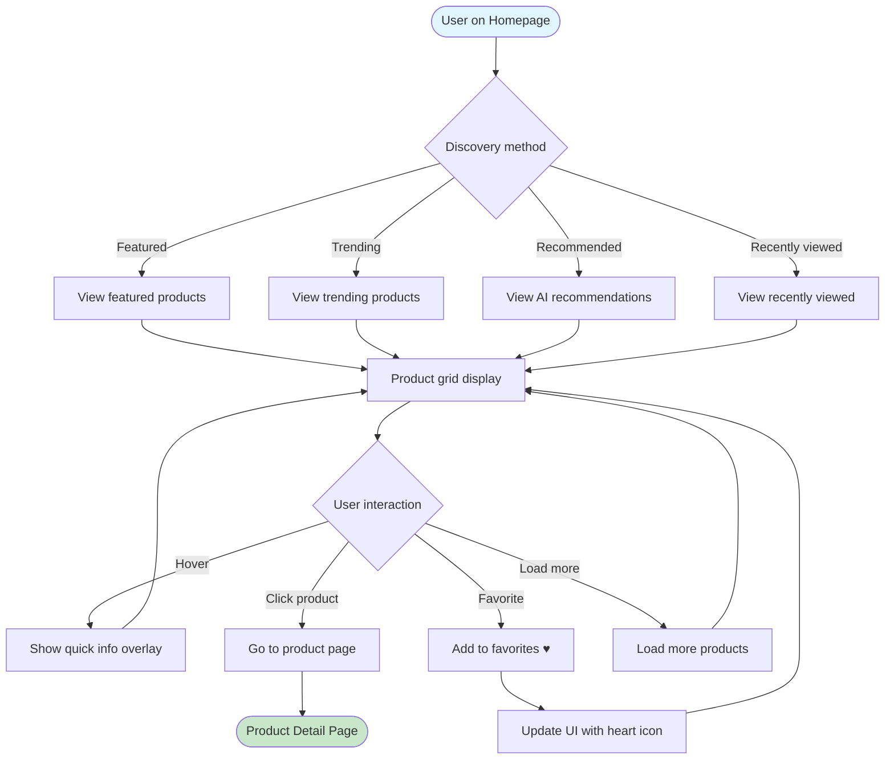

---

## 3. Product Purchase Flow

### Complete Purchase Journey

```mermaid
flowchart TD
    Start([Product Detail Page]) --> Decision{User decision}

    Decision -->|Add to cart| AddCart[Click 'Add to Cart']
    Decision -->|Buy now| BuyNow[Click 'Buy Now']
    Decision -->|Message seller| Message[Open messaging]

    AddCart --> SelectOptions{Product has<br/>variants?}
    SelectOptions -->|Yes| ChooseVariant[Select:<br/>- Color<br/>- Size<br/>- Storage]
    ChooseVariant --> ValidateSelection{Valid<br/>selection?}
    ValidateSelection -->|No| ErrorVariant[Show error: select all options]
    ErrorVariant --> ChooseVariant
    ValidateSelection -->|Yes| CartAdded

    SelectOptions -->|No| CartAdded[Item added to cart ✓]
    CartAdded --> ShowNotification[Show success notification]
    ShowNotification --> ContinueShopping{Continue<br/>shopping?}

    ContinueShopping -->|Yes| Browse([Continue browsing])
    ContinueShopping -->|No| GoToCart[Go to cart]

    BuyNow --> GoToCart

    GoToCart --> CartPage[Shopping Cart Page]
    CartPage --> ReviewCart[Review cart items]
    ReviewCart --> CartAction{Action?}

    CartAction -->|Update quantity| UpdateQty[Change quantity]
    UpdateQty --> RecalculateCart[Recalculate totals]
    RecalculateCart --> CartPage

    CartAction -->|Remove item| RemoveItem[Remove from cart]
    RemoveItem --> RecalculateCart

    CartAction -->|Apply coupon| ApplyCoupon[Enter coupon code]
    ApplyCoupon --> ValidateCoupon{Valid<br/>coupon?}
    ValidateCoupon -->|No| ErrorCoupon[Invalid coupon]
    ErrorCoupon --> CartPage
    ValidateCoupon -->|Yes| ApplyDiscount[Apply discount]
    ApplyDiscount --> RecalculateCart

    CartAction -->|Proceed| CheckAuth{Logged in?}

    CheckAuth -->|No| LoginPrompt[Prompt to login/register]
    LoginPrompt --> LoginFlow[Login flow]
    LoginFlow --> Checkout

    CheckAuth -->|Yes| Checkout[Checkout: Shipping]

    Checkout --> AddressForm{Has saved<br/>address?}
    AddressForm -->|Yes| SelectAddress[Select saved address]
    AddressForm -->|No| EnterAddress[Enter new address]

    SelectAddress --> ValidateAddress
    EnterAddress --> ValidateAddress{Valid<br/>address?}

    ValidateAddress -->|No| ErrorAddress[Show address errors]
    ErrorAddress --> EnterAddress
    ValidateAddress -->|Yes| ShippingMethod[Select shipping method:<br/>- Standard<br/>- Express<br/>- Overnight]

    ShippingMethod --> Payment[Checkout: Payment]
    Payment --> PaymentMethod{Select method}

    PaymentMethod -->|Credit card| CardDetails[Enter card details:<br/>- Number<br/>- Expiry<br/>- CVV]
    PaymentMethod -->|PayPal| PayPalFlow[PayPal redirect]
    PaymentMethod -->|Crypto| CryptoFlow[Crypto payment]

    CardDetails --> ValidateCard{Valid card?}
    ValidateCard -->|No| ErrorCard[Card validation error]
    ErrorCard --> CardDetails
    ValidateCard -->|Yes| Review

    PayPalFlow --> Review
    CryptoFlow --> Review

    Review[Checkout: Review Order]
    Review --> ShowSummary[Display:<br/>- Items<br/>- Shipping<br/>- Tax<br/>- Total]
    ShowSummary --> Confirm{Confirm<br/>purchase?}

    Confirm -->|No| EditOrder{Edit what?}
    EditOrder -->|Cart| CartPage
    EditOrder -->|Shipping| Checkout
    EditOrder -->|Payment| Payment

    Confirm -->|Yes| ProcessPayment[Process payment]
    ProcessPayment --> PaymentStatus{Payment<br/>successful?}

    PaymentStatus -->|No| PaymentError[Payment failed]
    PaymentError --> RetryPayment{Retry?}
    RetryPayment -->|Yes| Payment
    RetryPayment -->|No| Failed([Payment cancelled])

    PaymentStatus -->|Yes| CreateOrder[Create order in system]
    CreateOrder --> SendConfirmation[Send confirmation email]
    SendConfirmation --> OrderConfirmed[Order Confirmation Page]
    OrderConfirmed --> ShowDetails[Display:<br/>- Order number<br/>- Delivery estimate<br/>- Tracking info]

    ShowDetails --> NextAction{Next action?}
    NextAction -->|Track order| TrackOrder([Track Order Page])
    NextAction -->|Continue shopping| ContinueShop([Homepage])
    NextAction -->|View orders| OrderHistory([Order History])

    Message --> End([Messaging Page])

    style Start fill:#e1f5ff
    style Browse fill:#c8e6c9
    style TrackOrder fill:#c8e6c9
    style ContinueShop fill:#c8e6c9
    style OrderHistory fill:#c8e6c9
    style Failed fill:#ffcdd2
    style End fill:#c8e6c9
    style ErrorVariant fill:#ffcdd2
    style ErrorCoupon fill:#ffcdd2
    style ErrorAddress fill:#ffcdd2
    style ErrorCard fill:#ffcdd2
    style PaymentError fill:#ffcdd2
```

---

## 4. Selling a Product

### Create Product Listing

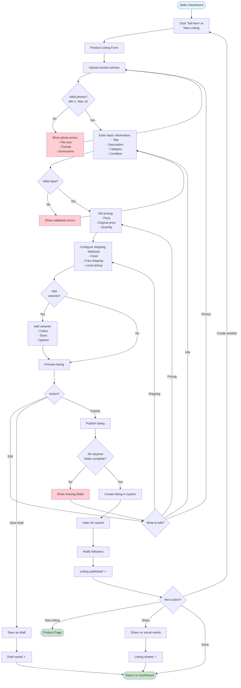

### Manage Listing

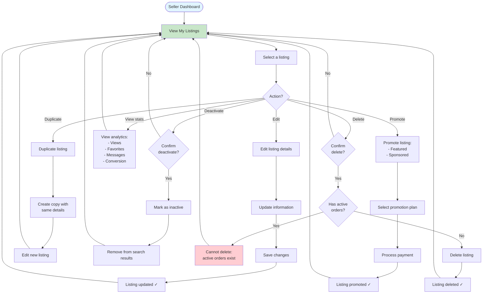

---

## 5. Messaging Flow

### Start Conversation

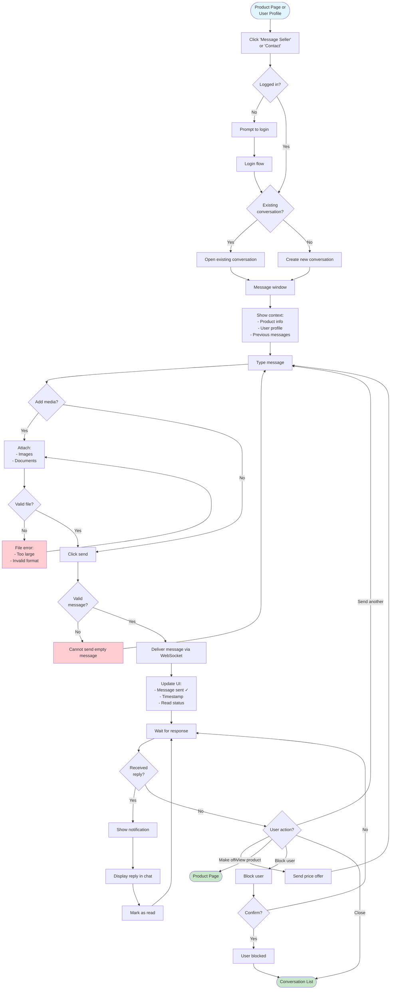

### Real-time Messaging

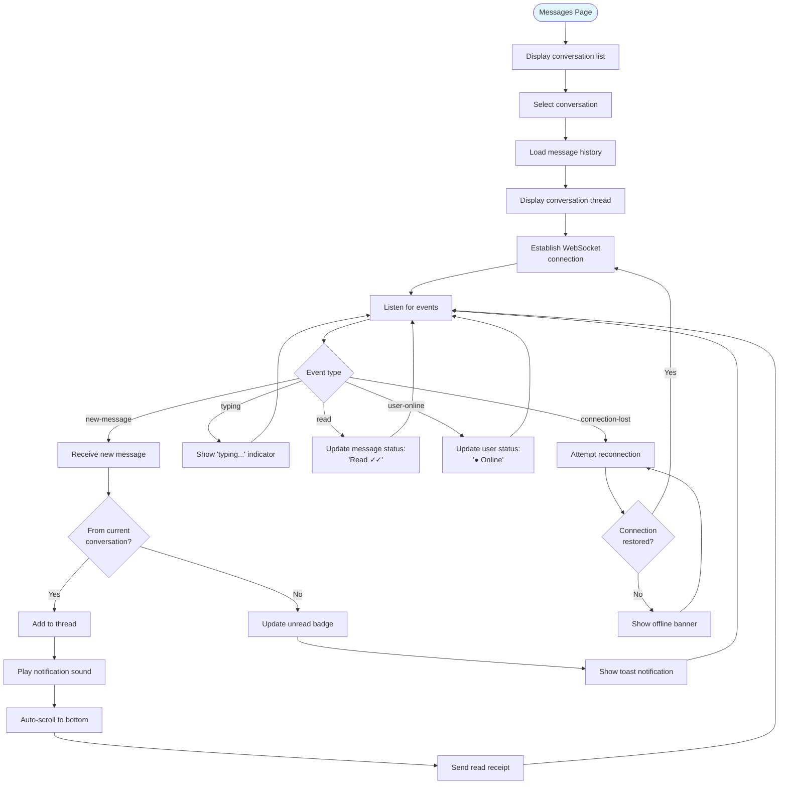

---

## 6. Review & Rating Flow

### Write Review

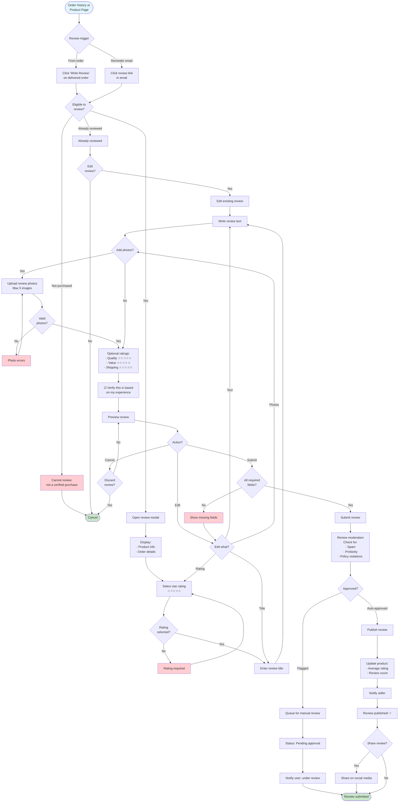

### Seller Response to Review

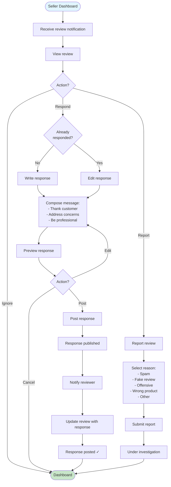

---

## 7. Order Management

### Track Order (Buyer)

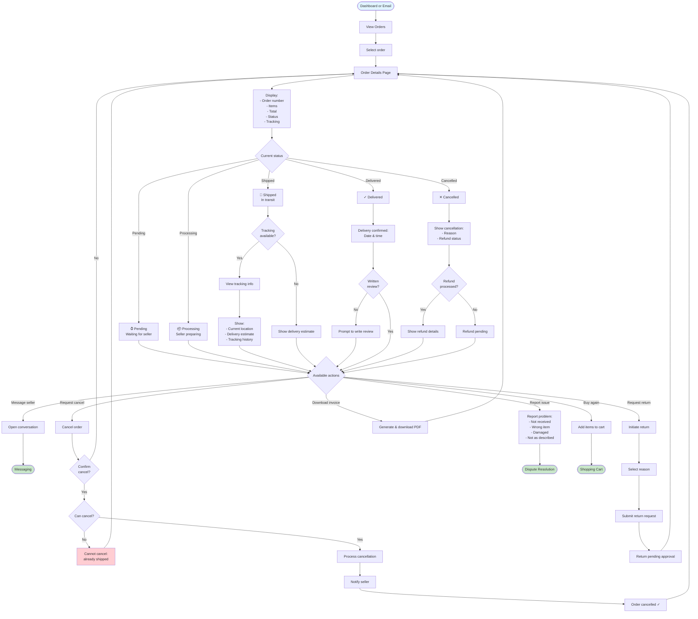

### Fulfill Order (Seller)

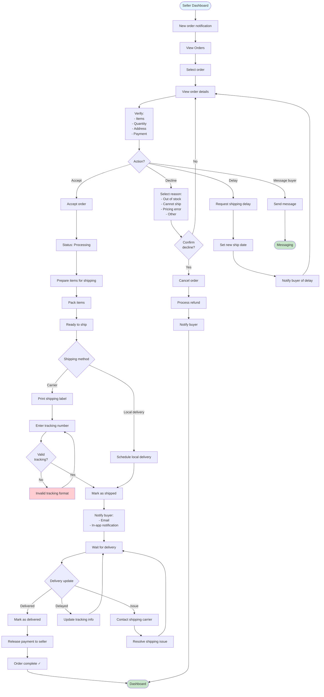

---

## 8. Dispute Resolution

### File Dispute (Buyer)

```mermaid
flowchart TD
    Start([Order Details]) --> Issues{Issue type}

    Issues -->|Not received| NotReceived[Item not received]
    Issues -->|Wrong item| WrongItem[Received wrong item]
    Issues -->|Damaged| Damaged[Item damaged]
    Issues -->|Not as described| NotAsDescribed[Not as described]
    Issues -->|Other| OtherIssue[Other issue]

    NotReceived --> FileDispute
    WrongItem --> FileDispute
    Damaged --> FileDispute
    NotAsDescribed --> FileDispute
    OtherIssue --> FileDispute

    FileDispute[Click 'Report Problem']
    FileDispute --> DisputeForm[Dispute form]

    DisputeForm --> SelectIssue[Select issue type]
    SelectIssue --> DescribeProblem[Describe problem]
    DescribeProblem --> UploadEvidence[Upload evidence:<br/>- Photos<br/>- Videos<br/>- Screenshots<br/>- Documents]

    UploadEvidence --> ValidateEvidence{Valid<br/>evidence?}
    ValidateEvidence -->|No| EvidenceError[Invalid files]
    EvidenceError --> UploadEvidence

    ValidateEvidence -->|Yes| RequestedResolution[Select desired resolution:<br/>- Full refund<br/>- Partial refund<br/>- Replacement<br/>- Return & refund]

    RequestedResolution --> ReviewDispute[Review dispute details]
    ReviewDispute --> SubmitConfirm{Submit<br/>dispute?}

    SubmitConfirm -->|No| Cancel([Cancel])
    SubmitConfirm -->|Yes| SubmitDispute[Submit dispute]

    SubmitDispute --> DisputeCreated[Dispute created<br/>Case #XXXX]
    DisputeCreated --> NotifySeller[Notify seller]
    NotifySeller --> SellerResponse[Wait for seller response]

    SellerResponse --> ResponseTime{Seller<br/>responds?}

    ResponseTime -->|Yes, within 48h| SellerOffer[Seller offers resolution]
    SellerOffer --> ReviewOffer[Review seller's offer]
    ReviewOffer --> AcceptOffer{Accept<br/>offer?}

    AcceptOffer -->|Yes| AcceptResolution[Accept resolution]
    AcceptResolution --> ProcessResolution[Process resolution:<br/>- Issue refund<br/>- Arrange return<br/>- Send replacement]
    ProcessResolution --> DisputeResolved[Dispute resolved ✓]
    DisputeResolved --> End([Case closed])

    AcceptOffer -->|No| Negotiate[Counter-offer or negotiate]
    Negotiate --> NegotiationRounds{Agreement<br/>reached?}
    NegotiationRounds -->|Yes| AcceptResolution
    NegotiationRounds -->|No| EscalateToAI

    ResponseTime -->|No, timeout| AutoEscalate[Auto-escalate after 48h]
    AutoEscalate --> EscalateToAI

    EscalateToAI[Escalate to AI analysis]
    EscalateToAI --> AIAnalysis[AI analyzes:<br/>- Evidence<br/>- Messages<br/>- Order history<br/>- User history]

    AIAnalysis --> AIDecision{AI confidence}

    AIDecision -->|High confidence| AIResolution[AI makes decision]
    AIResolution --> AutoResolve[Automatic resolution]
    AutoResolve --> NotifyBoth[Notify both parties]
    NotifyBoth --> AppealWindow[7-day appeal period]

    AppealWindow --> Appeal{Appeal<br/>filed?}
    Appeal -->|No| End
    Appeal -->|Yes| HumanReview

    AIDecision -->|Low confidence| HumanReview[Escalate to human mediator]

    HumanReview[Human mediator reviews case]
    HumanReview --> MediatorAnalysis[Mediator analyzes all evidence]
    MediatorAnalysis --> ContactParties[Contact both parties<br/>if needed]
    ContactParties --> MediatorDecision[Mediator makes decision]

    MediatorDecision --> FinalResolution[Final resolution:<br/>- Refund decision<br/>- Return required<br/>- No action]
    FinalResolution --> ExecuteResolution[Execute resolution]
    ExecuteResolution --> UpdateRecords[Update:<br/>- User records<br/>- Seller rating<br/>- Platform metrics]
    UpdateRecords --> End

    style Start fill:#e1f5ff
    style Cancel fill:#c8e6c9
    style End fill:#c8e6c9
    style EvidenceError fill:#ffcdd2
```

### Handle Dispute (Seller)

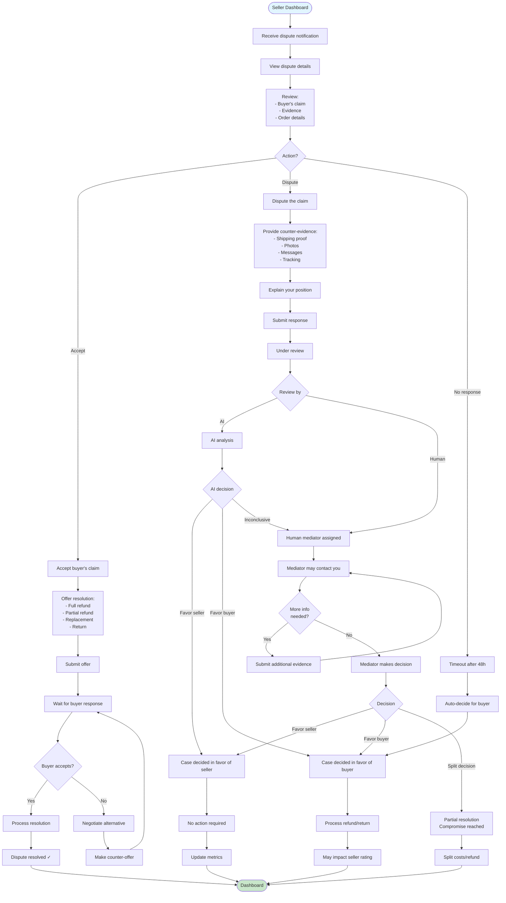

---

## Additional Flows

### Password Reset

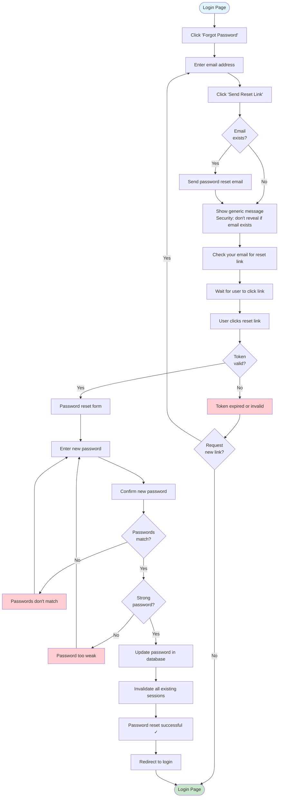

---

These user flow diagrams provide comprehensive visualization of all major user journeys in the Quantum Marketplace Exchange platform. They can be rendered in any Markdown viewer that supports Mermaid, including GitHub, GitLab, Notion, and many documentation tools.
